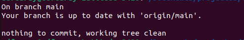
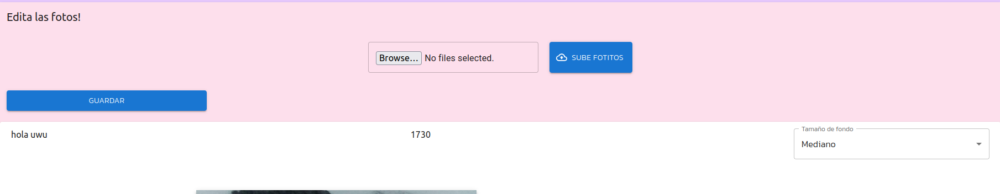
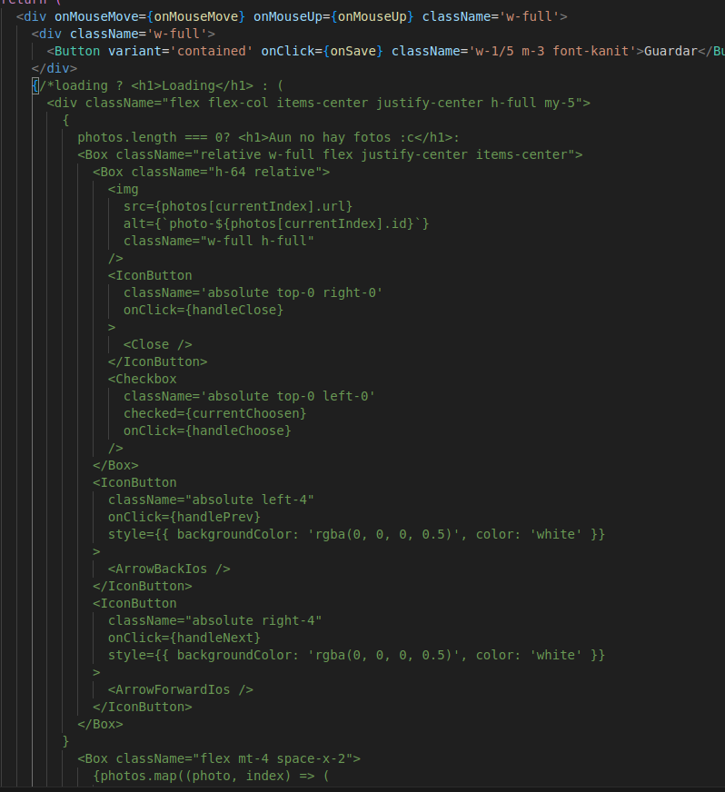
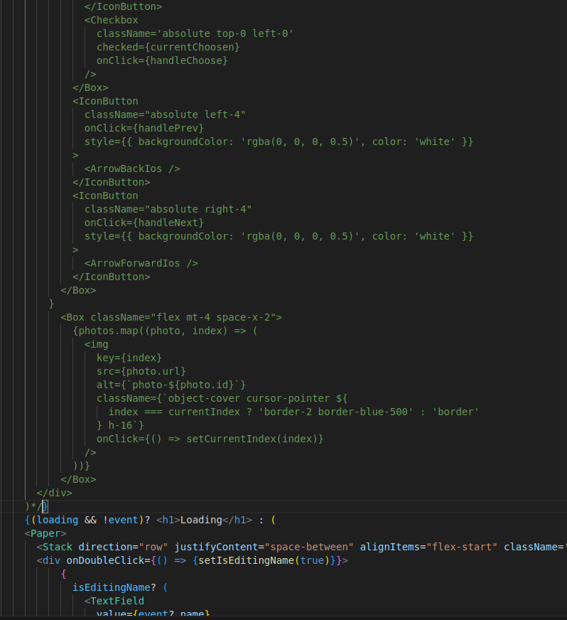

## Hola

Hola, este regalo, además de que todo esto lo hice con el mayor cariño del mundo, representa algo especial, único y puro entre los dos. 

Solo necesito que hagas algo previo antes que lo veas.

Escribe `git status` y verás algo similar a esto.

Escribe `git pull` y te deberá mostrar algunos cambios. La idea solo es que no sea posible ver la parte de aumentar o quitar fotos.

En caso de que aún puedas verlo, debes comentar el siguiente código en el archivo `src/app/recuerdos/component_photos/PhotosEditComplete.tsx`.

Solo eso :). Espero que te guste.
[Escucha esto mientras miras el regalo](https://www.youtube.com/watch?v=ZOTI95qvxrU)

pd: Si a futuro lo sigues usando (no lo sé en realidad), ya sabes que solo tienes que descomentar (similar a c++). 

pd2: Hay varias pequeñas cosas que faltaron (detalles de código). Quizás a un futuro (no cercano) los veré.

/////////////////////////////
## HINT
/////////////////////////////

En caso no encuentres nada, tienes una hint.

  
Hint

  Tu fecha de nacimiento.

